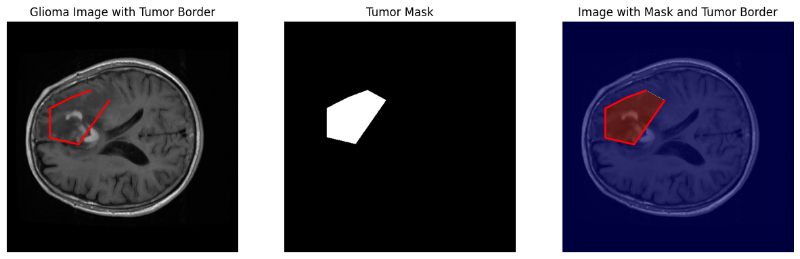

# 🧠 Brain MRI: Image Analysis, Machine Learning and Deep Learning

An academic capstone notebook covering MRI data preparation, tumour segmentation, classical classifiers and deep-learning experiments. **By Joana Owusu-Appiah.**

## Explore

📓 [Open the notebook](machine_and_deep_learning.ipynb) · 📖 [Workflow and data guide](docs/workflow.md)

## Setup

```bash
git clone https://github.com/Joana-Mansa/machine_deep_learning_project.git
cd machine_deep_learning_project
python -m venv .venv
source .venv/bin/activate
python -m pip install -r requirements.txt
jupyter lab machine_and_deep_learning.ipynb
```

## Data

The notebook describes 3,064 contrast-enhanced T1 images from 233 patients, stored in MATLAB `.mat` files with image, mask, label and patient-ID fields. Obtain the original dataset and place it in the directory structure used by the data-preparation cells; original inputs are not committed.

## Results and scope

This 359-cell notebook contains exploratory stages and hard-coded Colab/Drive/checkpoint paths. Run a selected stage with its inputs rather than assuming every experimental cell forms one unattended pipeline. Patient identifiers are available in the described data; preserve patient-level separation throughout preprocessing and evaluation. Historical metrics have not been reproduced in this pass.



This preview was exported from the original notebook’s saved output.

Related work: [VGG16 classification notebook](https://github.com/Joana-Mansa/brain_tumor_segmentations_and_classification).
